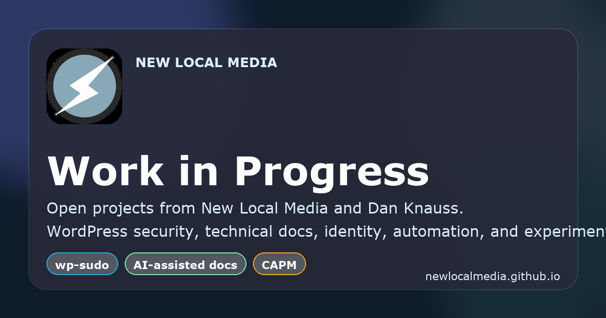

# Work in Progress

[](https://github.com/newlocalmedia/newlocalmedia.github.io/actions/workflows/site-quality.yml)
[](https://github.com/newlocalmedia/newlocalmedia.github.io/actions/workflows/update-repo-data.yml)
[](LICENSE)
[](https://newlocalmedia.github.io/)

Curated GitHub Pages showcase for New Local Media and Dan Knauss public projects, documentation, experiments, and demos.



## What this repo is

This repository powers the public site at [newlocalmedia.github.io](https://newlocalmedia.github.io/).

The site:

- showcases selected repositories from [`@newlocalmedia`](https://github.com/newlocalmedia) and [`@dknauss`](https://github.com/dknauss)
- rebuilds project detail pages from a GitHub data snapshot
- publishes a lightweight static site with no framework dependency
- includes basic quality checks for HTML, metadata, and generated outputs

## Quick start

```bash
npm install
npm run check
python3 -m http.server 8000
```

Then open [http://localhost:8000](http://localhost:8000).

## Available scripts

```bash
npm run build
npm run check
```

### What they do

- `npm run build` regenerates project pages and the sitemap from `/data/repos.json`
- `npm run check` rebuilds generated files, validates HTML, and checks required SEO/site metadata

## Repository structure

```text
.
├── assets/        Static images, icons, previews, and OG assets
├── data/          Generated repository snapshot data
├── projects/      Generated project detail pages
├── scripts/       Build, validation, and snapshot tooling
├── index.html     Homepage and client-side rendering logic
└── sitemap.xml    Generated sitemap
```

## How content gets updated

Repository data is refreshed by GitHub Actions on a schedule and can also be updated manually.

The workflow:

1. fetches repository data from GitHub
2. writes `/data/repos.json`
3. rebuilds project pages and `/sitemap.xml`
4. commits generated changes when the snapshot changes

## Contributing

Issues and pull requests are welcome for:

- content fixes
- layout or accessibility improvements
- metadata or SEO corrections
- automation and build improvements

See [CONTRIBUTING.md](CONTRIBUTING.md) for workflow details.

## Support and security

- General help: [SUPPORT.md](SUPPORT.md)
- Security reports: [SECURITY.md](SECURITY.md)

## License

This repository is available under the [MIT License](LICENSE).
